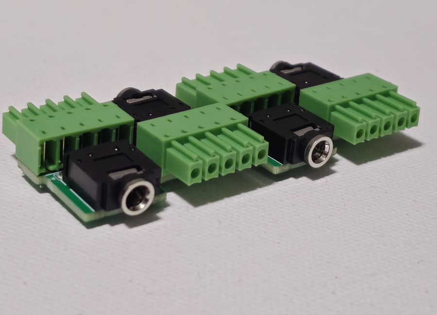
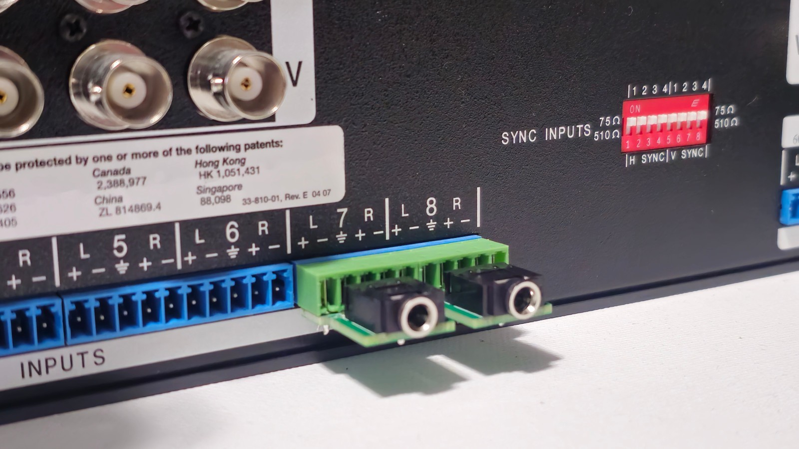

# Bi-Directional 3.5 mm TRS / Phoenix Audio Adapter

A compact, passive adapter between a **3.5 mm stereo TRS jack** and a **5-pin, 3.5 mm pitch Phoenix-style connector**, designed for compatible Extron audio inputs and outputs. The same assembled adapter works in either direction, so separate input and output versions are unnecessary.

I previously sold these adapters on eBay. I'm sharing the manufacturing files, parts list, and build notes here so others can make their own.

## Features

- Female 3.5 mm stereo TRS audio jack.
- 5-pin, 3.5 mm pitch Phoenix-style connector soldered directly to the PCB.
- Passive circuit with two 1 kΩ resistors; no power supply required.
- One design for compatible audio inputs and outputs.

The design was inspired by the Extron CSM 6 approach. Extron's [CSM 6/CSR 6 wiring guide](https://media.extron.com/public/download/files/userman/csm6csr6-man-c.pdf) describes using its adapter on input or output connectors. This project is an independent design.

## Compatibility and fit

I tested these adapters with an **Extron CrossPoint 450 Ultra** and an **Extron MVX**. Other equipment has not been confirmed here: check connector pitch, pinout, audio wiring, and physical clearance before use.

**CrossPoint clearance:** these units were designed for narrow plugs. To install multiple adapters side by side, the sides of the green connector housings may need sanding or trimming by a few millimeters on each side. Remove the adapter from the equipment before modifying its housing, and check the fit as you go.

Equipment such as the MVX series, where the connectors are spaced horizontally, may not need this modification.

The 3.5 mm connection carries **unbalanced stereo audio**: tip is left, ring is right, and sleeve is ground. It is not a mono balanced TRS connection. Compatibility with nonstandard equipment or cables is not guaranteed.

## Files

| File | Purpose |
| --- | --- |
| [Gerber ZIP](hardware/Gerber_PCB1_2026-10-02.zip) | Original PCB manufacturing export, including copper, masks, silkscreen, outline, and plated/non-plated drill files |
| [BOM export](hardware/BOM_Board1_PCB1_2026-10-02.csv) | Original component list exported on October 2, 2026; tab-delimited despite its `.csv` extension |
| [Build and wiring notes](docs/BUILD.md) | Assembly steps, PCB pad mapping, and electrical checks |
| [Photo gallery](docs/GALLERY.md) | Older V1.41 examples, V1.45 underside photo, and PCB layout screenshot |
| [Licence](LICENSE) | CERN Open Hardware Licence Version 2 – Permissive (`CERN-OHL-P-2.0`) |

**Editable schematic and PCB project files are not included in this release.** The Gerbers are manufacturing outputs; the layout screenshot is a visual reference. Neither replaces the original editable design project.

## Parts for one adapter

| Reference | Quantity | Part / value | Footprint | LCSC part number |
| --- | ---: | --- | --- | --- |
| CN1 | 1 | XKB Connection PJ-307N5 stereo jack | `AUDIO-TH_PJ-307N5` | C692542 |
| CN2 | 1 | KEFA KF2EDGA-3.5-5P connector | `CONN-TH_5P-P3.50_KF2EDGA-3.5-5P` | C6394076 |
| R1, R2 | 2 | UNI-ROYAL 0805W8F1001T5E, 1 kΩ | 0805 | C17513 |

These identifiers come from the supplied BOM. Check the exact footprint and mating connector when substituting parts; matching pitch alone does not establish compatibility.

## Build your own

1. Download the Gerber ZIP and review it in your PCB manufacturer's viewer. Confirm the outline, copper layers, and both drill files. Board thickness and finish are not specified by the supplied BOM; choose them after checking connector fit and manufacturer requirements.
2. Obtain one PCB and the parts listed above.
3. Solder R1 and R2 first, then the jack and Phoenix-style connector. Both connectors mount on the component side of the PCB.
4. Inspect for solder bridges and follow the [wiring checks](docs/BUILD.md#checks-before-use).
5. Check physical clearance, then test left and right audio on compatible equipment.

## Versions

The original listing described **V1.41 and V1.45 as functionally identical**, with V1.45 changing the PCB corner shape to angled edges. Most assembled photos show V1.41. The close-up underside photo and PCB layout screenshot are marked V1.45.

The supplied Gerber and BOM filenames record the October 2, 2026 export date. Review the actual manufacturing preview when ordering; the older product photos are not manufacturing drawings.

## Licence

Copyright © 2026 ihategravel2. The design files and accompanying project documentation and images are released under **CERN-OHL-P-2.0**. See [LICENSE](LICENSE) for the full terms and [NOTICE](NOTICE) for attribution and the source location.

The covered source and products are provided as-is, without warranty, as detailed in the licence.

For questions, build reports, or proposed improvements, [open an issue](https://github.com/ihategravel2/Bi-Directional-3.5mm-Phoenix-Adapter/issues).
