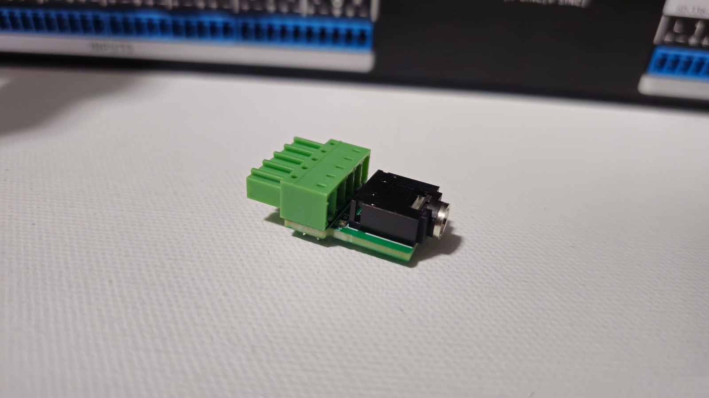
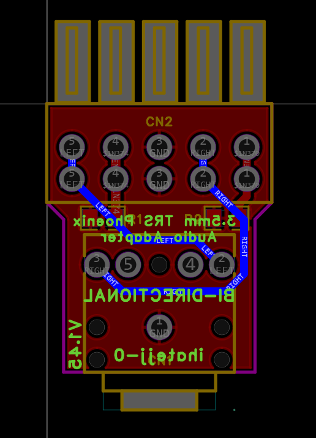

# Assembly and wiring

This release contains an original Gerber manufacturing export and BOM, plus the project owner's photos and compatibility notes. The wiring below is transcribed from `FlyingProbeTesting.json` inside the Gerber ZIP and the BOM. It has not been independently verified on a newly assembled board.

## Assembly

1. Review the Gerber ZIP in a manufacturing viewer before ordering. It includes top and bottom copper, top and bottom solder mask and silkscreen, the board outline, and separate plated and non-plated drill files. A top paste layer is also supplied.
2. Use the parts in the [README BOM](../README.md#parts-for-one-adapter). R1 and R2 are both **1 kΩ, 0805** resistors. They are not polarized.
3. Solder R1 and R2 on the component side first; access is easier before fitting the connectors.
4. Fit the PJ-307N5 jack at CN1 and KF2EDGA-3.5-5P connector at CN2 on the component side, as shown in the photos. Check orientation against the layout before soldering.
5. Seat the connectors flat, solder their pins, and inspect all joints and clearances.

## Electrical connections

The stereo jack uses tip = left, ring = right, and sleeve = ground.

| Extron audio signal | Connection on this adapter | CN2 pad number in the export |
| --- | --- | ---: |
| L+ | Left audio, directly to CN1 pad 2 (`LEFT`) | 5 |
| L− | To ground through R1, 1 kΩ | 4 |
| Ground | Directly to CN1 pad 1 (`GND`) | 3 |
| R+ | Right audio, directly to CN1 pad 3 (`RIGHT`) | 2 |
| R− | To ground through R2, 1 kΩ | 1 |

**CN2 numbers here are the PCB footprint's pad numbers**, not a universal numbering convention for Phoenix connectors. The connector is rotated in this layout. Match L+, L−, ground, R+, and R− to the equipment labels; do not infer the mating view from pad numbering alone.

CN1 pads 4 and 5 are on separate nets named `NET_1` and `NET_2` in the export. They are not the primary left/right audio connections listed above.

The two negative audio pins have resistive connections to ground, rather than direct shorts. Keep both 1 kΩ resistors in the assembled design.

The screenshot shows mirrored underside lettering and is an orientation reference, not an editable schematic or a manufacturing file.

## Checks before use

With the adapter disconnected from equipment, use a known stereo TRS plug to access the jack contacts and check:

- Tip connects to L+.
- Ring connects to R+.
- Sleeve connects to the center ground pin.
- L− to ground measures approximately 1 kΩ through R1.
- R− to ground measures approximately 1 kΩ through R2.
- There are no unintended shorts between left audio, right audio, and ground.

Inspect connector alignment and PCB clearance. For side-by-side CrossPoint installations, check whether the connector housing sides need trimming as described in the [README](../README.md#compatibility-and-fit).

Test left and right channels separately after assembly. The project owner reports testing previous adapters on an Extron CrossPoint 450 Ultra and an Extron MVX; no broader equipment compatibility or new hardware test is claimed for this documentation release.
