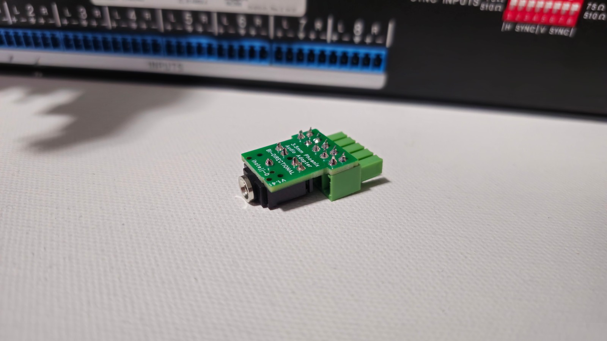
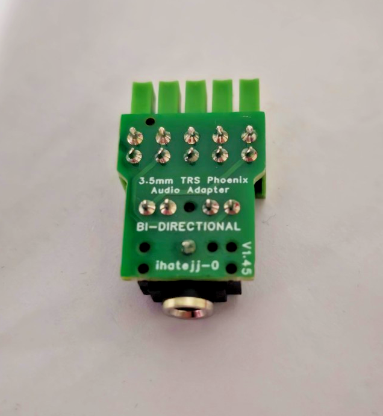

# Photos and layout

Original project images supplied by the designer. V1.41 and V1.45 were described as functionally identical, with a change to the PCB corner shape in V1.45.

## V1.41 assembled adapters

## V1.41 on an Extron CrossPoint

Side-by-side installation can require trimming the connector housing sides. See the [compatibility notes](../README.md#compatibility-and-fit).

## V1.41 underside

## V1.41 side view

## V1.45 underside

## V1.45 PCB layout screenshot

This screenshot is supplied as a visual reference. Use the [Gerber ZIP](../hardware/Gerber_PCB1_2026-10-02.zip) for manufacturing and review it in a Gerber viewer.
